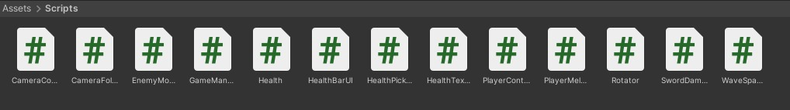
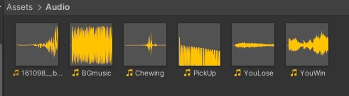
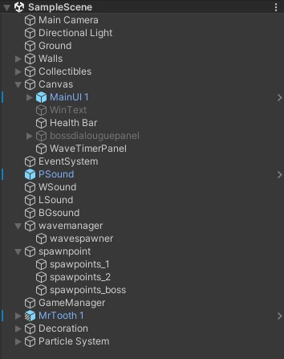
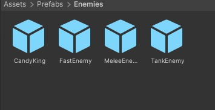

# Sweet Tooth

A 3D platform self-defense game developed as a collaborative academic project using Unity.

## Game Overview

Sweet Tooth is a level-based 3D platform game in which the player controls a toothbrush character.

The player progresses through different stages, fights snack-themed enemies and uses the toothbrush to defend against them. The difficulty increases as the player advances through the game.

The final stage features a boss fight against the Sugar King.

## Gameplay Features

- 3D platform-based gameplay
- Playable toothbrush character
- Self-defense and combat mechanics
- Snack-themed enemies
- Progressive level structure
- Increasing difficulty
- Background music and sound effects
- Final Sugar King boss fight

## Story

The toothbrush character enters a world controlled by unhealthy snacks.

The player must move through different stages, overcome obstacles and fight snack-themed enemies. After completing the stages, the player reaches the final encounter with the Sugar King.

## Level Progression

The game is designed around a progressive level structure.

The early stages introduce the player to the environment and basic gameplay mechanics. Later stages contain more challenging platforms, enemies and obstacles.

The game concludes with the Sugar King boss fight.

## My Contributions

I mainly contributed to the visual design and animation aspects of the project.

My responsibilities included:

- Scene and environment design
- Object placement and scene organization
- Visual editing of gameplay areas
- Animation preparation and implementation
- Supporting the design of different stages
- Contributing to the overall visual structure of the game

## Project Screenshots

### Unity Scripts

This screenshot shows the C# scripts used in the Unity project.

The scripts manage different gameplay systems, including the player, enemies, health, camera movement, wave spawning, weapons and overall game management.

### Audio Assets

This screenshot shows the audio assets used in the game.

The project includes background music and sound effects for actions such as chewing, collecting objects, winning and losing.

### Gameplay Environment

This screenshot shows the game environment and the platform-based level design.

It demonstrates the arrangement of platforms, objects and visual elements that form the playable area.

### Sugar King Boss Fight

This screenshot shows the final boss encounter against the Sugar King.

The boss fight represents the final challenge of the game and concludes the player's progression through the stages.

## Technologies

- Unity
- C#
- 3D Game Development
- Unity Animation System
- Unity Audio System

## Project Structure

The Unity project includes:

- `Assets` — Game assets, scenes, scripts, animations and audio files
- `Packages` — Unity package configuration
- `ProjectSettings` — Unity project settings
- Screenshot files — Visual documentation of the project

## Team Project

Sweet Tooth was developed collaboratively as an academic team project.

Team members contributed to different areas, including gameplay development, level design, visual design, animation, audio and programming.

## Project Status

This project was developed as a completed academic game project.

## Future Improvements

- Adding more playable levels
- Creating new snack-themed enemies
- Improving boss fight mechanics
- Adding more character animations
- Improving the user interface
- Adding a downloadable playable build

## Complete Project Files

The game assets, including 3D models, textures, animations and audio files, are available through the following Google Drive link:

[Download the game assets](https://drive.google.com/drive/folders/1F8TO-n9CeaBumlqDIZyzz7jCtzOvJSE-?usp=sharing)

The complete Unity project files can be accessed through the following Google Drive link:

## Author

Buse Nur Eser
